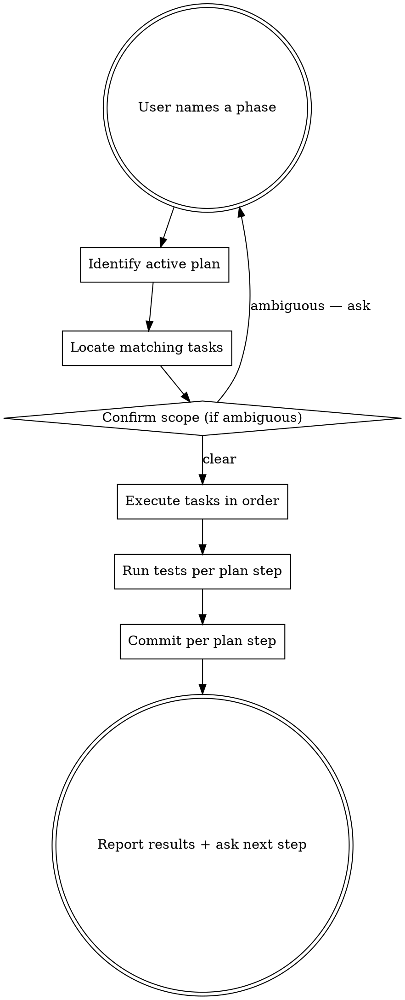

# jfmt-iterate

User-paced plan execution for the jfmt project. The user decides what
runs; this skill only runs the named scope, then halts.

## When to use

Invoke this whenever the user names a unit of work against the active
plan:

- "generate scaffolding" / "生成脚手架" / "do the scaffold"
- "task 1" / "task 5" / "第 3 个任务"
- "run the next task" / "继续下一个" / "继续"
- "all of M1" / "finish M1" (explicit batch — allowed only when the user
  says so)

If the user asks for code or changes without naming a phase, ask which
task/phase they want before touching files.

## When NOT to use

- Open-ended architectural questions → answer directly, don't invoke.
- Bug hunts on existing code → use `superpowers:systematic-debugging`.
- Spec or plan revisions → use `superpowers:brainstorming` /
  `superpowers:writing-plans`. This skill only executes approved plans.

## Core rule: never over-run

> Do exactly the scope the user named. Stop. Wait for the next instruction.

Running Task 5 when the user said "Task 4" is a failure of this skill.
So is running Tasks 3–8 when the user said "Task 3". When in doubt, do
less and ask.

## Workflow



## Step-by-step

### 1. Identify the active plan

Default: the most recent file under `docs/superpowers/plans/`. If there
are multiple, pick the one matching the current milestone per
`CLAUDE.md`. If the user's phrasing names a milestone (e.g. "M2"),
select that milestone's plan.

If no plan matches the user's named phase, say so and stop — do not
improvise.

### 2. Map "phase" to concrete tasks

Accepted phrasings and how to interpret them:

| User says | Scope |
|---|---|
| "scaffolding" / "脚手架" | M1 Tasks 1–2 (workspace init + CI) |
| "task N" / "第 N 个任务" | M1 Task N only |
| "tasks N-M" | those tasks, inclusive |
| "next task" / "继续" / "continue" | the next unchecked task in the plan |
| "all of Mx" / "finish Mx" | every task in that plan, sequentially |
| "until test pass" / "直到测试通过" | through the next Step that runs tests |

If a phrase doesn't cleanly map, ask for a concrete scope — don't guess.

### 3. Execute tasks in order

For each task in scope:

1. Read the task block from the plan.
2. Perform each step exactly as written — files, code, commands.
3. **Don't skip the "run the failing test" step.** The plan's TDD rhythm
   (failing test → impl → passing test → commit) is load-bearing.
4. If a command in the plan fails, stop and report — do not invent a
   fix beyond what the plan says. If the failure matches a contingency
   note in the plan (e.g. "if struson API moved, adjust to …"), follow
   it. Otherwise ask the user.
5. Commit at the end of the task with the plan's commit message.

### 4. Respect the commit convention

Every task ends with a commit. The plan gives the exact message. Use it
verbatim including the `Co-Authored-By` footer from the user's commit
workflow.

### 5. Never batch beyond scope

When the last task in the requested scope finishes, **stop immediately**.
Do not "while I'm here" extend into the next task, even if it's small.

### 6. Report

End every run with a short summary:

```
Done: Task 3 (core skeleton + Error type)
Tests: jfmt-core built clean, 0 tests run
Commit: feat(core): add Error type and crate skeleton  (abc1234)

Next per plan: Task 4 — Event and Scalar types.
Say "task 4" / "continue" to proceed, or name a different scope.
```

Keep the summary under ~10 lines unless the user asked for detail.

## Handling failures

If a step fails:

1. **Stop immediately.** Do not run further plan steps.
2. Print: what command was run, what the error was, what file is
   affected, whether the plan had a contingency note for this case.
3. Ask the user how to proceed. Do **not** revise the plan unilaterally
   — flag the issue and let them decide.

Common failure classes and what they mean:

- **Cargo resolve error:** dependency version mismatch. Compare
  `[workspace.dependencies]` against what the plan expected; check if a
  crate's API changed.
- **Clippy warning:** treat as failure (CI enforces `-D warnings`). Fix
  within the task or revert the change.
- **Test failure:** capture the exact failure message; if it's from a
  proptest shrink, include the shrunk input. Ask the user before
  "fixing" — sometimes the test is right and the impl is wrong, and the
  decision belongs to them.

## Boundaries

- **Do not** modify the spec without explicit approval.
- **Do not** expand a task's scope ("while I was in this file I also …").
- **Do not** add dependencies not listed in the plan.
- **Do not** invoke other implementation skills (`frontend-design`,
  `mcp-builder`, etc.) from here.
- **Do** invoke `superpowers:systematic-debugging` if a test failure
  looks like a real bug rather than a plan mismatch.

## Quick reference: plan location

```
docs/superpowers/specs/2026-04-23-jfmt-phase1-design.md    ← the contract
docs/superpowers/plans/2026-04-23-jfmt-m1-core-pretty-minify.md  ← M1 tasks
```

Subsequent plans land in the same directory, dated.
